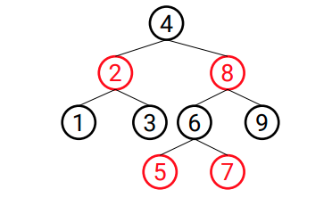

1. Implemente uma árvore rubro-negra e adicione os nós de modo que a árvore apresente
   a respectiva topologia abaixo.

2.  Implemente a operação de remoção de nós em uma árvore rubro-negra e valide
    removendo o nó 6 do exercício anterior.